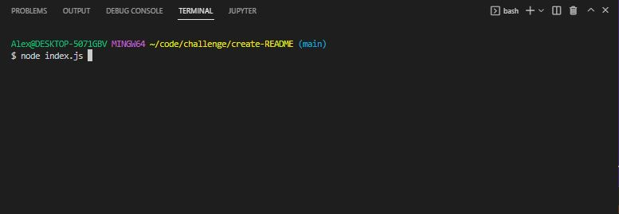
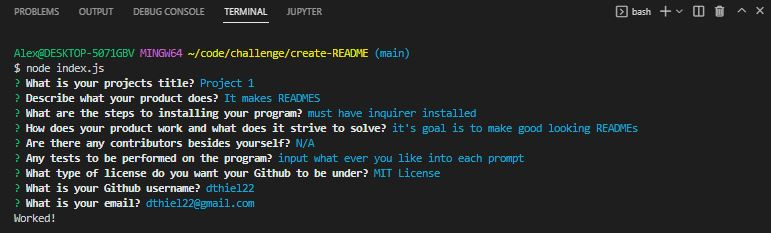
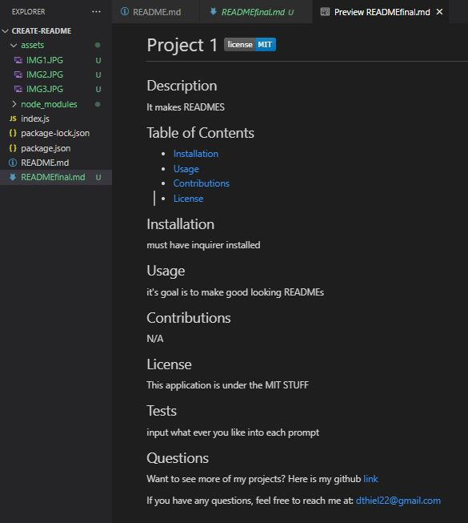

# Create A README

## Description

The reason behind this application is to build a README that looks professional and is customizable depending on the inputs placed in the integrated terminal.

## Installation

When downloaded from github, the package.json will already be prepared. All that needs to be done is run the integrated terminal and enter
```
npm i
```
This will download the library necessary to run the program.

if starting with only the index file, in the integrated terminal run the code
```
npm init
```
and follow it with
```
npm install inquirer
```

## Usage

To start, open the integrated terminal and input node index.js, as such



The program will launch and questions will appear in the integrated terminal. Answer each by inputting an answer and hitting ENTER when the question is answer.



After each question is answered, it will notify you the inputs were valid by logging "Worked!". A new README file will appear in your folder title 'READMEfinal.md'. Feel free to rename it to README.md. All user inputs are put into their selected fields, as you can see below.



A couple things to note. The badge at the top will change depending on which ever license was selected. The table of contents has links to the following sections in the README. Lastly, the github link created will open the link in your default browser. The email link is blue to stand out and can be copied for the users purpose.

Refer to the [video](https://drive.google.com/file/d/1WBEpy6om2scaJ_o2zyBjtP13HMWln6jx/view) to see the program step by step.

# Test

Feel free to run the program as many times as you want trying different inputs. Just know for everytime the program runs, the original will be overwritten if the original is not re-named.
